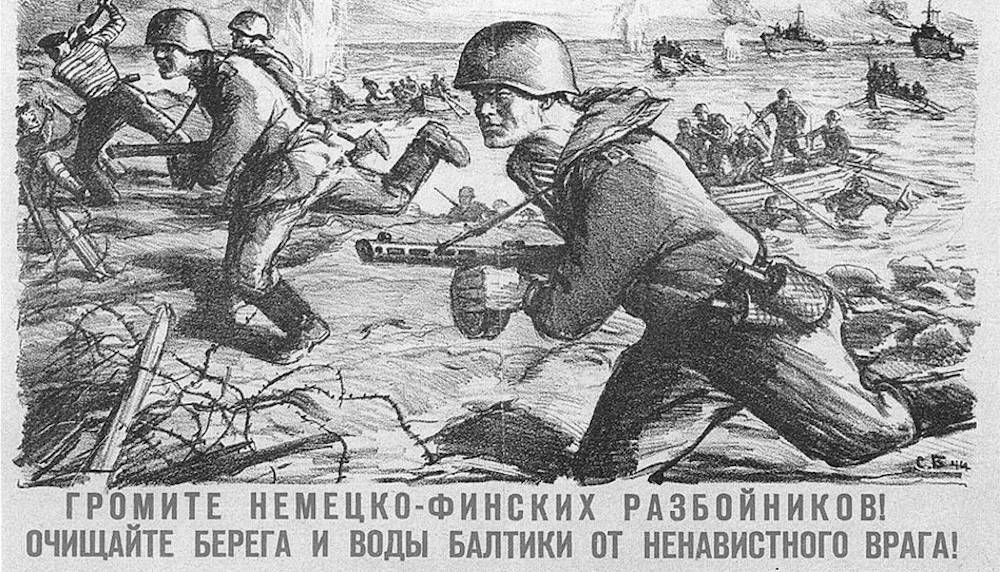

Советско-финская война 1939-1940 года (Советско-финская война, в Финляндии известна как Зимняя война) — вооружённый конфликт между СССР и Финляндией в период с 30 ноября 1939 года по 12 марта 1940 года.

Его причиной стало желание советского руководства отодвинуть финскую границу от Ленинграда (ныне Санкт-Петербург) с целью укрепления безопасности северо-западных границ СССР, и отказ финской стороны сделать это. Советское правительство просило предоставить в аренду части полуостроова Ханко и некоторых островов в Финском заливе в обмен на большую по площади советскую территорию в Карелии с последующим заключением договора о взаимопомощи.

Финское правительство считало, что принятие советских требований ослабит стратегические позиции государства, приведет к утрате Финляндией нейтралитета и ее подчинению СССР. Советское руководство, в свою очередь, не желало отказываться от своих требований, необходимых, по его мнению, для обеспечения безопасности Ленинграда.

Советско-финская граница на Карельском перешейке (Западная Карелия) проходила всего в 32 километрах от Ленинграда — крупнейшего центра советской промышленности и второго по величине города страны.

30 ноября 1939 года Сталин отдал приказ наступать на Карельском перешейке, и уже 1 декабря советские войска захватили город Терийоки (ныне — Зеленогорск).

На захваченной территории советская армия установила контакты с Отто Куусиненом, который являлся главой коммунистической партии Финляндии и активным участником Коминтерна. При поддержке Сталина он провозгласил создание Финляндской Демократической Республики. Куусинен стал ее президентом и начал от имени финского народа вести переговоры с Советским Союзом. Между ФДР и СССР были установлены официальные дипломатические отношения.

7-ая советская армия очень быстро продвигалась к линии Маннергейма. Первая цепь укреплений была прорвана в первой декаде 1939 года. Дальше советские солдаты продвинуться не смогли. Все попытки прорвать следующие линии защиты заканчивались потерями и поражениями. Неудачи на линии Маннергейма привели к приостановке дальнейшего продвижения вглубь страны.

Еще одна армия – 8-я – наступала на севере Ладожского озера. Всего за несколько дней войска преодолели 80 километров, но были остановлены молниеносной атакой финнов, в результате половина армии была уничтожена. Успех Финляндии был связан, в первую очередь, с тем, что советские войска были привязаны к дорогам. Двигавшиеся же небольшими мобильными отрядами финны легко отрезали технику и людей от необходимых коммуникаций. 8-я армия отступила, потеряв людей, но до самого конца войны не оставляла этот регион.

В районе полуострова Рыбачий довольно успешно наступала 14-ая армия. В течение короткого срока солдаты захватили город Петсамо с его никелевыми шахтами и вышли прямо на границу с Норвегией. Таким образом, Финляндия оказалась отрезанной от выхода к Баренцеву морю.

В январе 1940 года финны взяли в окружение 54-ю стрелковую дивизию (в районе Суомуссалми, на юге), но не имели сил и ресурсов для её уничтожения. Советские солдаты находились в окружении до марта 1940 года. Такая же участь ожидала и 168-ю стрелковую дивизию, которая пыталась продвигаться в районе Сортавалы. Также в финское окружение около Леметти-Южного попала советская танковая дивизия. Ей удалось выйти из окружения, потеряв всю технику и больше половины солдат.

Карельский перешеек стал зоной самых активных военных действий. Но к концу декабря 1939 года сражения тут прекратились. Вызвано это было тем, что руководство Красной Армии стало понимать тщетность ударов по линии Маннергейма. Финны попытались использовать затишье в войне с максимальной выгодой и перейти в атаку. Но все операции закончились неудачно с огромными человеческими жертвами.

К концу первого этапа войны, на январь 1940-го года, Красная Армия находилась в сложной ситуации. Она воевала на незнакомой, практически не изученной территории, продвигаться вперед было опасно из-за многочисленных засад. Кроме того, погода усложняла планирование операций. Незавидным было положение и финнов. У них были проблемы с количеством солдат и не хватало техники, но население страны имело колоссальный опыт в партизанской войне. Подобная тактика позволяла нападать малыми силами, нанося существенные потери крупным советским отрядам.

Уже 1-го февраля 1940 г. на Карельском перешейке Красная армия начала массированный артобстрел, длившийся 10 дней. Целью этой акции было нанесение урона укреплениям на линии Маннергейма и войскам Финляндии, вымотать солдат, морально сломить их дух. Предпринятые действия достигли поставленных целей, и 11 февраля 1940 года Красная Армия начала наступление вглубь страны.

На Карельском перешейке начались очень жестокие бои. Основной удар Красная армия сначала планировала нанести по населённому пункту Сумма, который находился на выборгском направлении. Но армия СССР стала вязнуть на чужой территории, неся потери. В результате направление главного удара было изменено на Ляхде. В районе этого населенного пункта оборона финнов была прорвана, что позволило Красной Армии пройти и первую полосу линии Маннергейма. Финны стали отводить войска.

К концу февраля 1940 года советская армия перешла и за вторую линию обороны Маннергейма, прорвав ее в нескольких местах. К началу марта финны стали отступать, поскольку находились в сложном положении. Резервы истощились, моральный дух солдат был сломлен. Другая ситуация наблюдалась в Красной Армии, главным преимуществом которой были огромные запасы техники, материальной части, пополняемый личный состав. В марте 1940 г. 7-я армия подошла к Выборгу, где финны оказали жесткое сопротивление.

13 марта боевые действия были прекращены, что было инициировано финской стороной.

Мирные переговоры начались 7 марта 1940 года и проходили в Москве. По результатам обсуждения, стороны решили прекратить боевые дйствия. Советский Союз получил все территории на Карельском перешейке и города: Салла, Сортавала и Выборг, располагавшиеся в Лапландии. Добился Сталин и того, чтобы ему отдали полуостров Ханко в длительную аренду.

