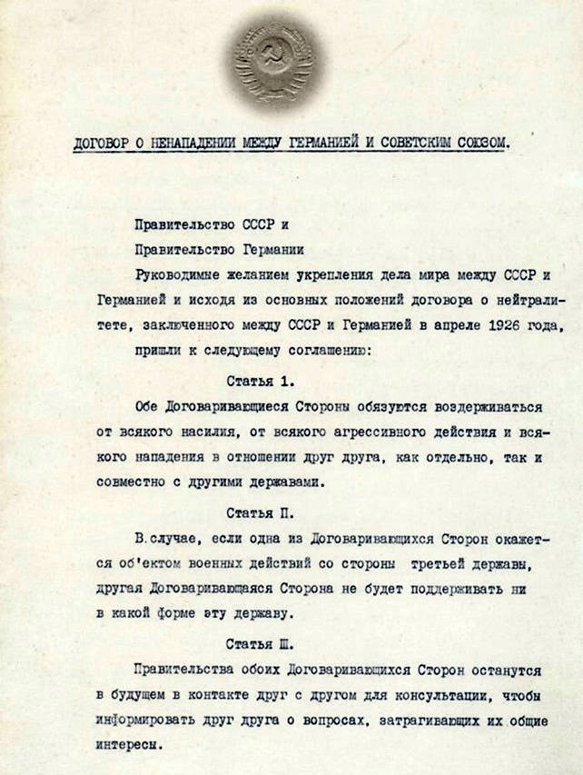

Договор о ненападении между СССР и Германией был подписан 23 августа 1939 года в Москве председателем Совета народных комиссаров СССР министром иностранных дел СССР Вячеславом Молотовым и министром иностранных дел Германии Иоахимом фон Риббентропом сроком на 10 лет. Инициатором Договора выступила германская сторона.

Советское правительство, убедившись в ходе Московских советско-англо-французских переговоров 1939 года в нежелании западных стран на деле сотрудничать с СССР в организации совместного отпора фашистской агрессии и опасаясь создания единого антисоветского фронта, было вынуждено искать альтернативный путь обеспечения безопасности страны, приняв германское предложение о заключении договора о ненападении.

Исходя из основных положений советско-германского договора о ненападении и нейтралитете (1926), стороны обязывались: воздерживаться от агрессивных действий и от нападения в отношении друг друга; в случае нападения на одну из сторон третьей державы не оказывать поддержки напавшей державе; не участвовать в группировках держав, направленных против одной из сторон; разрешать споры и конфликты между собой мирным путем.

