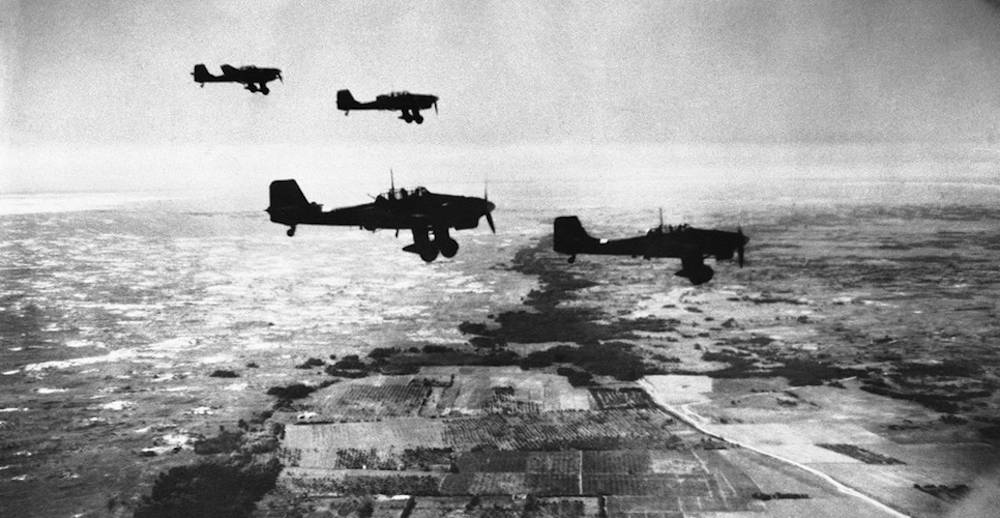

22 июня 1941 года нацистская Германия внезапно напала на СССР — своего союзника в войне с Польшей. Именно в этот день на территорию СССР вторглись 134 полностью боеспособные немецкие дивизии. Еще 73 дивизии были готовы к развертыванию за линией фронта. Вторжение началось менее чем через два года после подписания германо-советского пакта. Три группы армий напали на Советский Союз на широком фронте. Численность этих групп составила более трех миллионов немецких солдат. Поддержку оказывали 650 000 солдат союзников Германии (Финляндии и Румынии). Позднее к ним добавились подразделения из Италии, Хорватии, Словакии и Венгрии. Фронт растянулся от Балтийского моря на севере до Черного моря на юге.

Долгое время советское правительство отказывалось обращать внимание на предостережения западных держав о том, что Германия наращивает свою военную мощь на западной границе. Таким образом, Германия и ее союзники из стран Оси получили тактическое преимущество внезапности. Значительная часть советских воздушных сил была уничтожена на земле. Сопротивление советской армии поначалу было подавлено. Миллионы советских солдат попали в немецкое окружение. Отрезанные от снабжения и подкреплений, они были вынуждены сдаться в плен.

