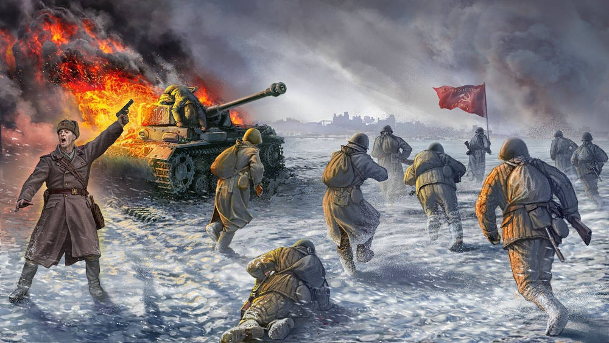

Сталингра́дская би́тва — одно из важнейших и крупнейших генеральных сражений Второй мировой и Великой Отечественной войн между Красной армией и вермахтом при поддержке армий стран «оси», закончившееся победой РККА.

Битва происходила с 17 июля 1942 года по 2 февраля 1943 года на территории современных Воронежской, Ростовской, Волгоградской областей и Республики Калмыкия.

Наступление войск нацистской Германии и её союзников продолжалось с 17 июля по 18 ноября 1942 года, его целью был захват большой излучины Дона, волгодонского перешейка и Сталинграда (современный Волгоград). Осуществление этого плана блокировало бы транспортное сообщение между центральными районами Союза ССР и Кавказом, создало бы плацдарм для дальнейшего наступления с целью захвата кавказских месторождений нефти.

За июль-ноябрь 1942 года Красной армии удалось заставить противника увязнуть в оборонительных боях, а до февраля 1943 года — окружить группировку немецко-фашистских войск в результате контрнаступательной операции «Уран», сорвать деблокирующее наступление гитлеровцев «Винтергевиттер» и сжать кольцо окружения к развалинам Сталинграда. Окружённая группировка 6-й армии капитулировала 2 февраля 1943 года, в том числе генерал-фельдмаршал Фридрих Паулюс и ещё 24 генерала вермахта.

Эта победа Красной армии, после череды поражений 1941—1942 годов, положила начало «коренному перелому» (перехвату советским главнокомандованием стратегической инициативы) не только в Великой Отечественной, но и во всей Второй мировой войне.

Сталинградская битва стала одной из самых ожесточённых и кровопролитных в истории человечества по количеству суммарных безвозвратных потерь (убитые, умершие от ран в госпиталях, пропавшие без вести) воевавших сторон: РККА — 478 741 человек (323 856 человек — в оборонительной фазе сражения и 154 885 человек — в наступательной), вермахт — около 300 000 человек, германские союзники (итальянцы, румыны, венгры, хорваты) — около 200 000 человек, численность погибшего городского населения невозможно установить даже приблизительно, но счёт идёт не менее чем на десятки тысяч.

Военным значением победы стало снятие угрозы захвата вермахтом и его союзниками территорий Нижнего Поволжья и Кавказа, а также бакинских нефтяных месторождений.

Следствием победы СССР в битве стало то, что Турция отказалась от вторжения в СССР весной 1943 года, Япония не предприняла планируемый Сибирский поход, Румыния (Михай I), Италия (Пьетро Бадольо), Венгрия (Миклош Каллаи) стали искать возможности для выхода из войны и заключения сепаратного мира с Великобританией и США.

