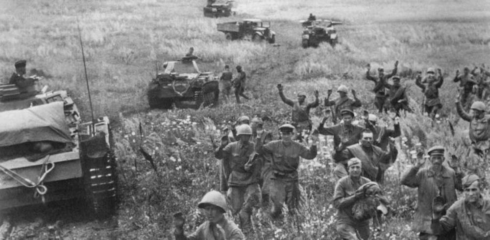

Битва под Киевом, Киевская операция (1941), Киевский котёл — крупномасштабное сражение Великой Отечественной войны между СССР и Германией в июле — сентябре 1941 года, закончившееся окружением и разгромом Красной армии.

С немецкой стороны в сражении участвовала группа армий «Юг» под командованием фельдмаршала Рундштедта, а также 2-я танковая группа Гудериана из группы армий «Центр», с советской — войска Юго-Западного фронта под командованием генерала-полковника М. П. Кирпоноса в составе пяти общевойсковых армий и Пинской флотилии под командованием контр-адмирала Д. Д. Рогачёва, под общим руководством Маршала Советского Союза С. М. Будённого.

В конце августа 1941 года, после захвата Смоленска, Гитлер проигнорировал предложения своих генералов по продолжению наступления на Москву и перебросил 3-ю танковую группу с центрального направления на северное, а 2-ю танковую группу — на южное. 2-я танковая группа, двигаясь на юг восточным берегом Днепра, совершила глубокий охват советского Юго-Западного фронта, который отступил в район Киева после поражения в Львовско-Черновицкой стратегической оборонительной операции. Советские войска были окружены и разгромлены, общие потери составили около полумиллиона человек; остатки фронта отступили в район Воронежа.

Поражение под Киевом стало тяжёлым ударом для Красной Армии. На 1 сентября в Юго-Западный фронт без фронтовых резервов, запасных частей и тылов входили 752—760 тысяч человек, 3923 орудия и миномёта, 114 танков и 167 боевых самолётов.

К моменту окружения в котле оказались 452 700 человек, 2642 орудия, 1225 миномётов, 64 танка.

По немецким данным под Киевом к 24 сентября было взято в плен 665 тысяч человек.

По данным, опубликованным в 1993 году Генштабом Вооружённых Сил РФ, советские потери составили свыше 700 тысяч человек, из них 627 800 безвозвратно.

В эти цифры входят людские потери при обороне самого Киева по рубежу Киевского укрепрайона. Они составили около 48 000 человек общих потерь для РККА и около 14 000 человек общих потерь для Вермахта.

Из окружения удалось вырваться подразделению начальника оперативного управления фронта генерал-майора Баграмяна, части 5-й воздушно-десантной бригады полковника А. И. Родимцева, некоторым частям 26-й армии во главе с генерал-лейтенантом Ф. Я. Костенко.

