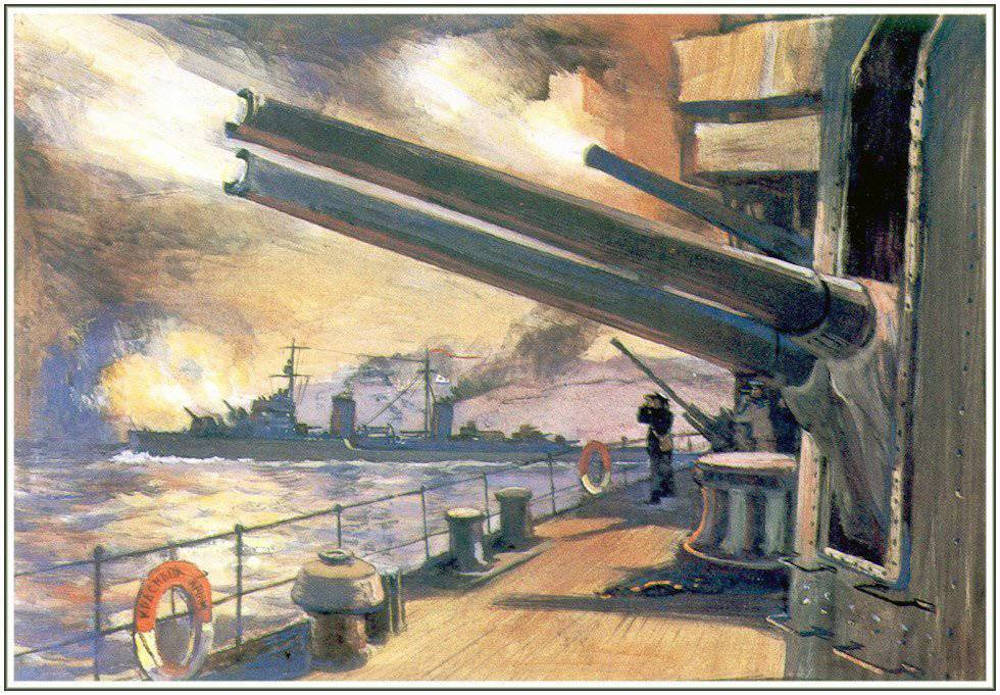

5 августа 1941 года в ходе Великой Отечественной войны началась героическая оборона Одессы.Одесса стала прифронтовым городом почти сразу после начала Великой Отечественной войны. Неприятель бомбил Одессу уже 22 июля 1941 года. Положение на Одесском направлении было осложнено прорывом советской обороны на Днестре, который осуществили 11-я немецкая и 4-я румынская армии. 19 августа решением Ставки после отхода войск Южного фронта за Днепр был образован Одесский оборонительный район (ООР) под командованием контр-адмирала Г. В. Жукова с подчинением командующему Черноморским флотом. При обороне города пятикратно превосходящим силам врага противостояли войска Отдельной Приморской армии (сначала под командованием генерал-лейтенанта Г. П. Софронова, затем генерал-майора И. Е. Петрова) и силы Черноморского флота, также активное участие принимали жители Одессы.

Одним из ярчайших и героических событий обороны Одессы является Григорьевский десант – первый морской десант ВМФ СССР на Черном море. Одновременно с морским десантом был осуществлен воздушный. Целью десанта, высаженного в районе деревни Григорьевки (отсюда и название десанта) Коминтерновского района Одесской области, было содействие контрудару оборонявшихся под Одессой советских войск. В результате успешного выполнения данной операции линия фронта была отодвинута от города на 5–8 километров, а две румынские пехотные дивизии разгромлены.

После гибели большей части войск Юго-Западного фронта в окружении под Киевом и оккупации противником Донбасса возникла реальная угроза прорыва врага в Крым. Для усиления обороны полуострова и главной базы Черноморского флота – Севастополя – было принято решение о проведении скрытой эвакуации Приморской армии.  

Эта операция проводилась в несколько этапов с 1 по 16 октября. Враг совершенно не подозревал о ее проведении, и, когда ворвался в город, регулярных советских войск в нем уже не было. Зато его ждали хорошо организованное за период обороны вооруженное подполье в городе и партизанские отряды в окрестностях. В листовках, оставленных красноармейцами для врага, говорилось, что скоро они вернутся в город. Таким образом, оборона Одессы и уникальная по своей сути операция по эвакуации города стали одними из самых успешных операций РККА и ВМФ СССР первого периода войны. А Одесса по праву получила звание города-героя в числе первых городов, удостоенных этой высокой чести.

