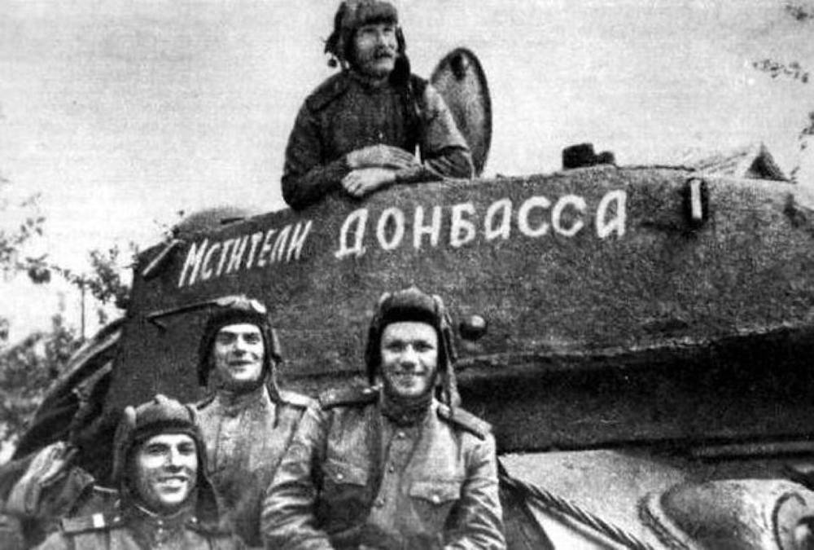

Донбасская операция (13 августа — 22 сентября 1943) — стратегическая военная операция Вооружённых сил СССР против войск нацистской Германии с целью освобождения Донецкого бассейна.

Операцию по освобождению Донбасса в официальной советской историографии иногда принято считать частью битвы за Днепр ввиду их одновременного проведения. Ее началом принято считать 13 августа, когда войска Юго-западного фронта форсировали Северский Донец и оттянули на себя немецкие резервы. Непосредственно на территории Донбасса боевые действия начались 16 августа, когда советские войска предприняли ряд не вполне удачных попыток штурма немецких укреплений. Однако уже 18 августа Красная армия благодаря массированной артподготовке смогла завладеть инициативной и совершить ряд прорывов. В результате части вермахта, находясь под угрозой окружения, 30 августа начали отступление за Днепр. 5 сентября был освобожден Артемовск (Бахмут), 8 сентября Сталино (Донецк), а 8 сентября Мариуполь. 22 числа операция завершилась разгромом противника и освобождением региона. Новая линия фронта установилась на участке Днепропетровск — Запорожье.

Донбасская операция позволила Красной армии закрепится на Левобережье Днепра и окончательно отрезать Третий Рейх от поставок угля. Кроме того, в результате успешного наступления советских воинов Германия вынуждена была оставить Кубань, перенаправив эти части в Крым, где впоследствии они были уничтожены (в рамках Крымской операции 1944 года).

Однако несмотря на триумф, Красной армии на освобожденных территориях пришлось лицезреть ужасающую картину. Немцы действовали в рамках стратегии «выжженой земли», чтобы замедлить продвижение советских войск. По данным немецких источников, в результате 284 000 гражданских лиц были убиты. Кроме того, с территории было вывезено 268 000 тонн зерна, 280 000 голов крупного рогатого скота, 209 000 лошадей, 363 000 овец, 18 700 свиней, 800 тракторов и 820 грузовиков. Мариуполь и Донецк оказались разрушены. В 1948 году английским военным трибуналом в Гамбурге Манштейн был приговорен к 18 годам тюремного заключения. Однако уже в 1953 оказался на свободе по состоянию здоровья.

