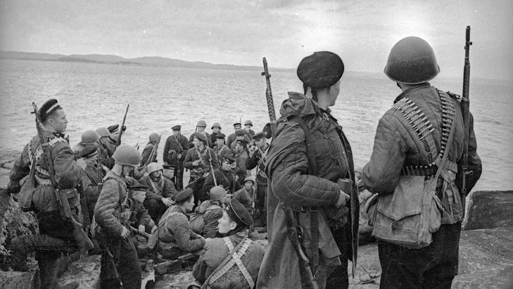

Керченско-Эльтигенская десантная операция (31 октября — 11 декабря 1943 года) — операция войск Северо-Кавказского фронта (с 20 ноября 1943 года — Отдельная Приморская армия), Черноморского флота и Азовской военной флотилии при поддержке 4-й воздушной армии. Целью операции было нанесение удара северо-восточнее Керчи и Эльтигена, освобождение города и порта Керчь, овладение портом Камыш-Бурун и дальнейшее освобождение Крыма.

После освобождения Таманского полуострова войска Северо-Кавказского фронта приступили к подготовке форсирования Керченского пролива и последующих боев за Крым. В первой декаде октября 1943-го было установлено, что противник уделяет особое внимание фортификационным работам на Керченском полуострове.

На Керченском полуострове оборонялись части германской пехотной, румынских кавалерийской и горнострелковой дивизий, около 10 отдельных частей и команд 17-й армии противника. На побережье были развернуты 56 артиллерийских, минометных и 23 зенитные батареи. Войска поддерживались авиацией 4-го воздушного флота и морскими силами.

В сложившейся обстановке было принято решении о проведении десантной операции для создания плацдарма на Керченском полуострове и развертывания последующих действий по освобождению Крыма.

К участию в операции привлекались силы 56-й и 18-й армий Северо-Кавказского фронта, Черноморский флот и Азовская военная флотилия (всего около 130 тыс. солдат и офицеров, более 2 тыс. орудий и минометов, 125 танков).

В ходе операции планировалось высадить 3 стрелковые дивизии 56-й армии северо-восточнее и восточнее Керчи и одну стрелковую дивизию 18-й армии – в районе Эльтигена (вспомогательное направление). Затем этим войскам надлежало ударами по сходящимся направлениям овладеть восточной частью Керченского полуострова с портами Керчь и Камыш-Бурун. В состав десантных отрядов вошли: 16 отрядов катеров и вспомогательных судов, 2 отряда артиллерийской поддержки и 2 отряда прикрытия (119 боевых катеров, 159 вспомогательных судов и плавсредств), войска и силы артиллерийской и авиационной поддержки (667 орудий и 90 реактивных установок артиллерии, 1001 самолет).

Артиллерийская подготовка в районе Эльтигена продолжалась 15 минут, в продолжение которых было израсходовано 8334 снаряда. В артиллерийской подготовке высадки войск 56-й армии, продолжавшейся 23 минуты, участвовало 420 орудий и 2 полка реактивной артиллерии, а также артиллерия 18-й армии. Самолеты 4-й воздушной армии нанесли удары по обороне противника. Однако систему его огня полностью нарушить не удалось.

Посадка десантных войск на катера, суда и плавсредства началась вечером 31 октября. Из-за сильного шторма десантные войска 56-й армии не смогли высадиться к установленному сроку. Части и подразделения 18-й армии, несмотря на плохую погоду, на рассвете 1 ноября высадились в районе Эльтигена. Отразив контратаки противника, они захватили плацдарм до 5 км по фронту и до 2 км в глубину. Воспользовавшись тем, что на участках 56-й армии высадка не состоялась, противник бросил против них превосходящие силы. Однако десантники держались.

Высадившиеся части при поддержке артиллерии и авиации, преодолевая противодействие и минные поля противника, вели бои за расширение плацдарма. В ночь с 1 на 2 ноября в район Эльтигена было дополнительно перевезено 3270 человек, 4 орудия, 9 минометов, 22,7 т боеприпасов и 2 т продовольствия. Высадка 1-го эшелона войск 18-й армии численностью 6 тыс. к утру 2 ноября была завершена.

Огневую поддержку этих войск, занимавших простреливаемый всеми видами оружия плацдарм, осуществляла береговая артиллерия флота (55 орудий). Это значительно снизило возможности десантников, которые вели бои в течение 40 суток, к противодействию. Воспользовавшись тем, что противник сосредоточил основные силы на борьбе с защитниками Эльтигенского плацдарма, в ночь на 3 ноября Азовская флотилия высадила северо-восточнее Керчи войска 56-й армии.

Высадку первого броска поддерживали около 200 орудий и полк реактивной артиллерии 56-й армии. К 12 ноября войска этой армии очистили от противника северо-восточный выступ Керченского полуострова, вышли к Булганаку и северо-восточным окраинам Керчи, где перешли к обороне до начала Крымской операции 1944 года.

Десантники 18-й армии продолжали удерживать Эльтигенский плацдарм, полностью блокированный с моря и воздуха, пока не получили приказ прорваться в район Керчи для соединения с войсками, занимавшими оборону северо-восточнее города. 6 декабря 1943 года 1700 обессиленных десантников прорвали оборону противника, совершили 20-километровый марш и, выйдя на южную окраину Керчи, захватили гору Митридат. 10–11 декабря они были эвакуированы.

В результате этой операции советские войска овладели плацдармом, сыгравшим в последующем важную роль при освобождении Крыма.

