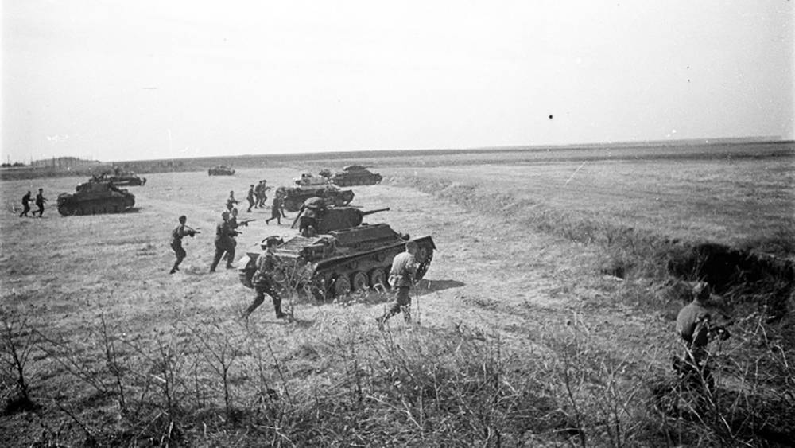

Смоленская операция 1943, наступательная операция войск Западного и левого крыла Калининского фронтов 7 августа — 2 октября во время Великой Отечественной войны 1941—45. В летне-осенней кампании 1943 войска Калининского и Западного фронтов имели задачу наступать на западном (смоленском) направлении с целью разгрома левого крыла группы армий «Центр», овладения рубежом Смоленск, Рославль и развития наступления на Витебск, Оршу, Могилёв. К началу операции в составе Калининского (командующий генерал армии А. И. Еременко) и Западного (командующий генерал-полковник В. Д. Соколовский) фронтов имелось 1253 тыс. человек, около 20 640 орудий и миномётов, 1430 танков и самоходно-артиллерийских установок и свыше 1000 боевых самолётов. На смоленском направлении оборонялось свыше 40 дивизий 3-й танковой и 4-й армий группы армий «Центр» (командующий генерал-фельдмаршал Г. Клюге, всего до 850 тыс. человек, около 8800 орудий и миномётов, около 500 танков и штурмовых орудий, около 700 самолётов). Немецко-фашистские войска, используя лесисто-болотистую местность, создали прочную оборону из 4—5 оборонительных полос на глубину до 130 км.

  7 августа перешли в наступление войска ударной группировки Западного фронта и 13 августа освободили Спас-Деменск, 30 августа Ельню, 1 сентября Дорогобуж, 16 сентября Ярцево и к 23 сентября охватили группировку врага в районе Смоленска с Юга. 13 августа началось наступление войск левого крыла Калининского фронта, которые 19 сентября овладели Духовщиной, 21 сентября Демидовом и охватили группировку врага в районе Смоленска с Севера. Под угрозой окружения противник начал отход. 25 сентября были освобождены Смоленск и Рославль. В начальник октября советские войска вышли на подступы к Витебску, Орше, Могилёву. Большую помощь фронтам оказали партизаны Смоленской и Калининской областей. В ходе С. о. была освобождена Смоленская область, советские войска продвинулись на глубину до 225 км, разгромили 5 пехотных, 1 танковую, 1 моторизованную дивизии, нанесли поражение 11 пехотным, 3 танковым, 1 моторизованным дивизиям и сковали крупные силы врага, создав благоприятные условия для наступления на главном, юго-западном направлении.

